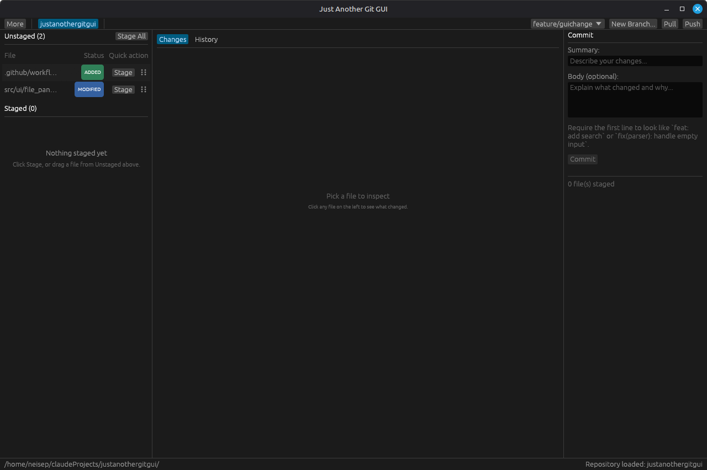

# Just Another Git GUI

**Just Another Git GUI** is a lightweight desktop Git client built in Rust with `egui`.

It focuses on the everyday local workflow first—review changes, stage files, commit, switch branches, inspect history—and adds a practical GitHub flow on top: publish an existing folder, sign in with GitHub device flow, push branches, and jump straight into the relevant pull request page.

<p align="center">
  <a href="https://github.com/neisep/justanothergitgui/releases">Download</a>
  &middot;
  <a href="https://github.com/neisep/justanothergitgui/issues">Report Bug</a>
  &middot;
  <a href="https://github.com/neisep/justanothergitgui/issues">Request Feature</a>
</p>

<p align="center">
  <a href="https://github.com/neisep/justanothergitgui/releases"></a>
  <a href="https://github.com/neisep/justanothergitgui"></a>
  <a href="https://github.com/neisep/justanothergitgui/actions"></a>
</p>

---


## 📸 Screenshot


---

## About

This project aims to be a simple, fast, user-friendly Git desktop app without depending on the GitHub CLI.

The application combines:

- a native Rust desktop UI with `eframe` / `egui`
- local Git operations through `git2`, with Git CLI use limited to history rendering
- direct GitHub API integration for repository publishing and pull request actions
- secure GitHub session persistence through the operating system keychain / credential store

---

## Features

- **Open an existing repository** from disk
- **View unstaged and staged changes** in separate panes
- **Stage / unstage individual files** or use **Stage All** / **Unstage All**
- **Drag and drop files between staged and unstaged lists**
- **Review diffs** in a built-in changes view with line numbers and optional wrapping
- **Write commits** from the right-hand commit panel with a **Summary** field and optional **Body**
- **Optionally enforce Conventional Commits** from a settings dialog
- **Autocomplete Conventional Commit prefixes** with inferred scopes from changed paths
- **Use keyboard-friendly dialogs and shortcuts** for common actions
- **Switch branches** from the toolbar
- **Create a new branch** from inside the app
- **Create and push tags** from `main` / `master`
- **Browse commit history** with a visual graph lane
- **Resolve merge conflicts** with built-in “Accept Ours / Theirs / Both” actions
- **Pull and push** directly from the main toolbar
- **See unpushed local commits** directly on the **Push(n)** button
- **Automatically set upstream** on first push for a new branch
- **Publish a local folder to GitHub** as a new repository
- **Sign in to GitHub with OAuth Device Flow**
- **Persist GitHub sign-in securely** in the system keychain
- **Detect existing pull requests after push**
- **Open an existing PR or create a new one** in the browser
- **View sanitized application logs** from inside the UI when an operation fails

---

## GitHub Workflow

Just Another Git GUI includes a built-in GitHub publishing and pull request flow:

1. **Publish Folder to GitHub** initializes a repository if needed, creates the first commit, creates the GitHub repository, adds `origin`, and pushes `main`
2. **Sign in to GitHub** uses OAuth Device Flow and stores the session in the OS credential store
3. **GitHub pushes and pulls inside the app** use that saved device-flow session consistently
4. **GitHub tag pushes inside the app** use that same saved device-flow session
5. After you **push a branch**, the app checks whether a pull request already exists
6. If a PR exists, you get a shortcut to **open it**
7. If not, you get a shortcut to **create one**

This is implemented directly in Rust without relying on `gh`.

For repositories that do **not** use GitHub, the app still uses `git2` for local commit/branch work and for remote push/pull through the configured non-GitHub transport credentials.

---

## Getting Started

### Prerequisites

- **Rust** 1.85 or later
- **Git** installed and available on your system
- On Linux, a working **Secret Service / keychain environment** is recommended for GitHub session persistence

### Build from Source

#### Linux (Debian / Ubuntu / Mint)

```bash
git clone https://github.com/neisep/justanothergitgui.git
cd justanothergitgui
cargo build --release
```

Binary:

```bash
target/release/justanothergitgui
```

#### Windows

```powershell
git clone https://github.com/neisep/justanothergitgui.git
cd justanothergitgui
cargo build --release
```

Binary:

```powershell
target\release\justanothergitgui.exe
```

---

## Usage

1. **Launch the app**
2. **Open a repository** or choose **Publish Folder to GitHub...**
3. Review changes in the **unstaged** and **staged** panels
4. **Stage files**, inspect diffs, and enter a commit summary with an optional body
5. **Commit** from the right-side panel
6. **Switch branches** or create a new one from the toolbar
7. Use **Pull** / **Push** and PR shortcuts from the top-right area
8. When the current branch has local commits that are not on the remote yet, the app shows them as **Push(n)**
9. Use **More** for secondary actions like settings, publishing, cleanup, tags, and logs
10. On `main` or `master`, use **More > Create Tag...** to tag the current HEAD commit
11. If you are working with GitHub, **sign in once** and let the app handle publishing, tag pushes, and PR shortcuts

### Keyboard Shortcuts

- **Ctrl/Cmd+S** stages the selected file, or unstages it when the selected file is already staged
- **Ctrl/Cmd+Enter** commits staged changes
- **Ctrl/Cmd+R** or **F5** refreshes repository status
- **Ctrl/Cmd+L** focuses the commit summary field
- dialogs focus the first editable field when they open, and **Escape** closes the active dialog

### Commit Message Rules

Use **More > Settings...** to leave commit message validation off or enable **Conventional Commits**.

When Conventional Commits is enabled:

- the first line of the commit message must match the Conventional Commits format
- invalid commit messages are blocked before commit or repository publish
- typing a prefix like `fix` shows scope-aware suggestions such as `fix(ui): ` or `fix(ui,settings): `
- inferred scopes come from changed file paths and the repository / crate name when needed
- custom scopes from **Settings...** stay available in the suggestion list
- a plain no-scope option like `fix: ` is always available

### GitHub Sign-In

The app uses **GitHub OAuth Device Flow**:

- the app shows a device code
- your browser opens GitHub’s approval page
- after approval, the session is stored in the OS credential store

On restart, the saved GitHub session is loaded automatically if the system keychain allows access.

For GitHub repositories, the in-app push, pull, and tag flow expects `origin` to use an HTTPS GitHub URL so the saved device-flow session can be reused consistently.

If an operation fails, the UI shows a short message and writes sanitized details to the application log. When logs exist, use **More > View Logs** in the app to inspect them.

---

## Project Structure

```text
src/
├── main.rs              # Application entry point and native window setup
├── app.rs               # Main app orchestration, dialogs, toolbar, GitHub flow
├── git_ops.rs           # Git and GitHub operations
├── state.rs             # Shared UI state and actions
├── worker.rs            # Background worker for long-running operations
└── ui/
    ├── bottom_bar.rs    # Status bar
    ├── commit_panel.rs  # Commit editor panel
    ├── diff_panel.rs    # Diff view and conflict resolution UI
    ├── file_panel.rs    # Staged / unstaged file lists
    └── history_panel.rs # Commit history and graph lane
```

---

## Design Goals

- **Simple local workflow** for common Git tasks
- **Friendly GitHub integration** for publishing and pull requests
- **Minimal external runtime dependencies**
- **Cross-platform desktop UX** with Rust and `egui`
- **Secure credential storage** instead of plain-text tokens

---

## Contributing

Contributions are welcome.

1. Fork the repository
2. Create a feature branch: `git checkout -b feature/my-change`
3. Make your changes
4. Run:

```bash
cargo fmt --all
cargo build
cargo test
```

5. Push your branch and open a pull request

---

## Roadmap

Areas that would be valuable to improve next:

- richer branch and remote management
- stashes and cherry-pick support
- better repository settings and preferences
- improved history graph for more complex merge topologies
- release packaging for Linux and Windows
- screenshots and demo media for the GitHub project page

---

## Acknowledgements

- [egui](https://github.com/emilk/egui) - immediate mode GUI framework
- [eframe](https://github.com/emilk/egui/tree/master/crates/eframe) - native app wrapper for egui
- [git2-rs](https://github.com/rust-lang/git2-rs) - Rust bindings for libgit2
- [keyring-rs](https://crates.io/crates/keyring) - secure credential storage
- [GitHub REST API](https://docs.github.com/en/rest) - repository and pull request integration
